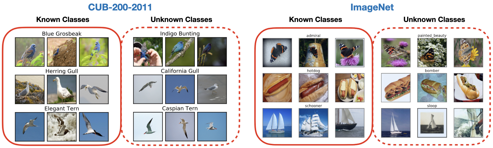

This repo contains a Python API for easy download and data loading of the [Semantic Shift Benchmark (SSB)](https://www.robots.ox.ac.uk/~vgg/research/osr/).

# Contents

:question: [What is the SSB?](#what-is-the-ssb)

:nut_and_bolt: [Setup](#setup)

:zap: [Example commands](#example-ssb-api-commands)

:clipboard: [Citation](#citation)

:gem: [DATA.md](./DATA.md)

# What is the SSB?

The Semantic Shift Benchmark (SSB) is used for machine learning tasks which explore semantic shift (a.k.a label shift and concept drift) between different sets of images. Examples include [open-set recogntion](https://ieeexplore.ieee.org/abstract/document/6365193) (a.k.a [near-OoD detection](https://arxiv.org/abs/2106.03004)) and [category discovery](https://arxiv.org/abs/1908.09884).

It takes existing image recognition datasets, and constructs 'unknown_classes' splits which have varying semantic similarity with set of 'known_classes'. 

It contains splits for: ImageNet; CUB-200-2011; Stanford Cars; and FGVC-Aircraft. More information can be found in [DATA.md](./DATA.md) and the [original paper](https://www.robots.ox.ac.uk/~vgg/research/osr/).



# Setup

There are some steps in the setup, including: setting up a Kaggle account;
setting up an SSB JSON config; installing python requirements; and installing this SSB Python package. 
All steps are detailed below.

## Set up Kaggle

Some datasets require the Kaggle API to download:

```
conda install -c conda-forge kaggle
```

If you don't have an API key:

1. Go to Kaggle, create an account and log in. 
2. Click the top right icon and scroll to 'Settings'
3. Click 'Create New Token'

Place the API key in your home directory:
```
mkdir ~/.kaggle
mv /path/to/kaggle.json ~/.kaggle/
chmod 600 ~/.kaggle/kaggle.json
```

To download the ImageNet-1K dataset, you will also need to click 'Join Challenge' [here](https://www.kaggle.com/competitions/imagenet-object-localization-challenge/overview) while logged into your Kaggle account.

## Set up SSB JSON config

Place an SSB config at ```~/.ssb/ssb_config.json```. This contains paths to where you wish to download the datasets, or else points to existing datasets. The expected dataset format and more details are in [DATA.md](/DATA.md).

E.g:

```
{
    "cub_directory": "~/data/CUB", 
    "aircraft_directory": "~/data/FGVC_Aircraft", 
    "scars_directory": "~/data/Stanford_Cars/",
    "imagenet_1k_directory": "~/data/imagenet_1k",
    "imagenet_21k_directory": "~/data/imagenet_21k"
}
```

## Python requirements

We have tested the API with the following package versions, 
but older ones should work too as we use only basic functionality for dataloading.

```
kaggle==1.15.16
torchvision==0.15.2
torch==2.0.0
scipy==1.11.1
```

## Install the API

Install with pip:

```
pip install git+https://github.com/sgvaze/SSB.git
```

Or to install in interactive mode.

```
git clone https://github.com/sgvaze/SSB.git
cd SSB
pip install -e .
```

# Example SSB API commands

## Download datasets
You can download the datasets in a single command, 
or else point to datasets which you already have in ```~/.ssb/ssb_config.json```.

The datasets to download are: ```cub```, ```aircraft```, ```scars```, ```imagenet_1k```, ```imagenet_21k```.

More details are in [DATA.md](/DATA.md).

```
>> from SSB.download import download_datasets
>> download_datasets(['cub', 'aircraft', 'scars', 'imagenet_1k', 'imagenet_21k'])
```

## Get Generalized Category Discovery (GCD) datasets

The options for GCD datasets are:

```
('cub', 'aircraft', 'scars', 'imagenet_easy', 'imagenet_hard')
```

For the fine-grained benchmarks, the (Hard, Medium, Easy) splits are all used in the returned datasets. For ImageNet, the Easy and Hard splits are returned separately due to their size.

Documentation is given inside the function in ```SSB/get_datasets/get_gcd_datasets_funcs.py```.


```
>> from SSB import get_gcd_datasets
>> all_datasets = get_gcd_datasets('cub', train_transform, test_transform)
```

## Get Open-Set Recognition (OSR) datasets

Only ImageNet is currently supported in the OSR challenge. 
The SSB split (i.e Easy or Hard).

Documentation is given inside the function in ```SSB/get_datasets/get_osr_datasets_funcs.py```.

Specifying ```eval_only=True``` means only the test datasets will be returned (the ImageNet-1k training set is not loaded). This is faster.

```
>> from SSB import get_osr_datasets
>> all_datasets = get_osr_datasets('imagenet', train_transform, test_transform, eval_only=True)
```

## Example evaluation

An example evaluation of open-set recognition, or near-OoD detection is given in ```examples/evaluate_osr.py```.

# TODO

* Baseline benchmarking for GCD and OSR

# Citation

If you find the SSB useful in your research, please consider citing:
```
@InProceedings{vaze2022openset,
      title={Open-Set Recognition: a Good Closed-Set Classifier is All You Need?},
      author={Sagar Vaze and Kai Han and Andrea Vedaldi and Andrew Zisserman},
      booktitle={International Conference on Learning Representations},
      year={2022}
      }
```
